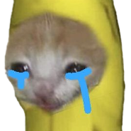

<p align="center">
 
</p>

<h1 align="center">Bananocat</h1>

<p align="center">
  Una mascota digital que vive en tu escritorio de Windows.
</p>

<p align="center">
  
  
  
</p>

## Sobre el proyecto

Bananocat es un pequeño gato en pixel art que vive en tu escritorio de Windows.
Flota encima de tus ventanas, sin fondo ni bordes, y te acompaña mientras
trabajas o estudias. Por ahora solo se queda quieto, pero la idea es que con el
tiempo pueda caminar, reaccionar al cursor y tener su propio comportamiento.

### ¿Por qué este proyecto?

Lo estoy desarrollando para aprender Python y programación de interfaces
gráficas con Qt (PySide6) construyendo algo real, no solo ejercicios sueltos.

En lugar de copiar código terminado, lo construyo paso a paso y por versiones,
entendiendo cada parte antes de avanzar: cómo funciona una ventana, cómo se
dibujan los sprites, cómo se calculan las coordenadas y cómo responde el
programa a los eventos del mouse. Cada versión agrega una sola función nueva
y queda guardada con su propio tag en Git, así que el historial del repositorio
muestra cómo fue creciendo el proyecto.

### Arte

Todos los sprites están dibujados por mí en [Pixelorama](https://pixelorama.org).

## Estructura del proyecto

```
desktop-bananocat/
├── assets/
│   └── cat/
│       ├── cat.png          # sprite del gato
│       └── cat_icon.png     # ícono de la bandeja del sistema
├── desktop_cat/
│   ├── __init__.py
│   ├── paths.py             # rutas centralizadas del proyecto
│   ├── pet_window.py        # ventana transparente que muestra al gato
│   └── tray.py              # ícono y menú de la bandeja del sistema
├── main.py                  # punto de entrada: crea las piezas y arranca la app
└── requirements.txt
```

Cada módulo tiene una sola responsabilidad. La idea principal del diseño es
**"la ventana dibuja, el gato decide"**: la ventana solo sabe mostrar una imagen
en una posición, y la lógica del gato (estados, movimiento, comportamiento)
vivirá en módulos separados a medida que el proyecto crezca.

## Conceptos aplicados

**v0.1**
- Event loop y programación orientada a eventos
- Herencia de widgets de Qt y sobrescritura de métodos
- Ventanas sin bordes, siempre encima y ocultas de la barra de tareas (window flags)
- Transparencia por píxel y canal alfa en imágenes PNG
- Sistema de coordenadas de pantalla y área disponible del monitor
- Rutas independientes del directorio de trabajo con `pathlib`
- Señales y slots de Qt
- Referencias y recolector de basura en Python
- Organización del código en paquetes y módulos
- Entornos virtuales y control de versiones con Git (tags por versión)

## Instalación

```bash
git clone https://github.com/jzzzph/desktop-bananocat.git
cd desktop-bananocat
python -m venv .venv
.venv\Scripts\activate
pip install -r requirements.txt
```

## Uso

```bash
python main.py
```

Para cerrarlo: clic derecho en el ícono de la bandeja del sistema → **Salir**.

## Roadmap

- [x] v0.1: gato estático en el escritorio
- [ ] v0.2: animación idle
- [ ] v0.3: caminar
- [ ] v0.4: movimiento por el escritorio
- [ ] v0.5: interacción con el mouse